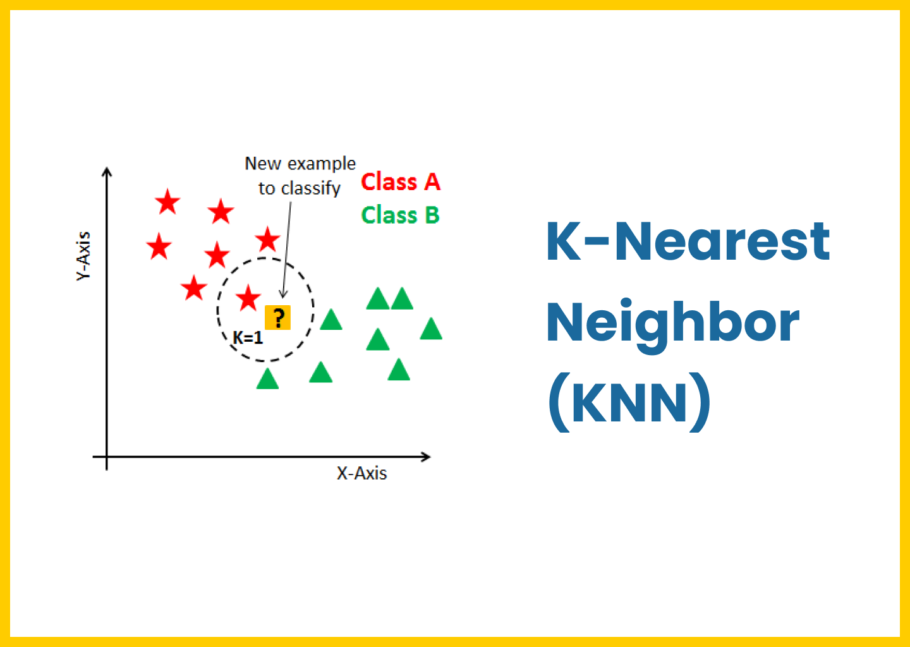
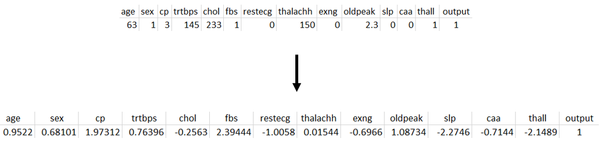

# Klasifikasi Kemungkinan Serangan Jantung dengan Algoritma K-Nearest Neighbor

Algoritma K-Nearest Neighbour termasuk dalam metode pengklasifikasian data mining. K-Nearest Neighbour (KNN) memiliki prinsip kerja dengan mencari jarak terdekat antara data yang akan dievaluasi dengan k tetangga terdekatnya dalam data pelatihan (Risa Helilintar, Risky Awi, Siti Rochana. 2017)

Tujuan KNN adalah untuk mengklasifikasi objek baru berdasarkan atribut dan sample dari training data dengan menggunakan classification sebagai nilai prediksi dari nilai instance yang baru (Asep Maulana Ismail, 2018)

## Algoritma KNN

Berikut urutan proses kerja KNN (Gorunescu dalam Risa Helilintar, dkk. 2017) :

- Menentukan parameter k (jumlah tetangga paling dekat)
- Menghitung kuadrat jarak euclidean (euclidean distance) masing-masing objek terhadap data sampel yang diberikan
- Mengurutkan objek-objek ke dalam kelompok yang mempunyai jarak Euclid terkecil
- Mengumpulkan kategori Y (Klasifikasi Nearest Neighbor)
- Menggunakan kategori Nearest Neighbor yang paling sering muncul sebagai hasil prediksi

Pada penjelasan dokumentasi ini, akan ditampilkan contoh perhitungan manual dengan nilai k=5 dan beberapa sampel data. Implementasi lebih detail dapat dilihat pada file ipnyb yang ada di repositori ini.

## Persiapan Data

Data yang digunakan adalah Heart Attack Analysis & Prediction Dataset yang tersedia di Kaggle. Dataset terdiri atas 14 kolom dan 303 baris data.

Karena algoritma KNN bergantung pada nilai jarak Euclid, dilakukan standardisasi dimana data yang dimiliki akan diubah sehingga memiliki rata rata = 0 (terpusat) dan standar deviasi = 1.

Proses standardisasi ini dapat dilakukan menggunakan Class StandardScaler yang tersedia di Library Sklearn pada Python. Selanjutnya, bagi data ke dalam set training dan testing. Dataset train untuk pelatihan, sedangkan test untuk uji/evaluasi.

## Menentukan Nilai Parameter K

Nilai K merepresentasikan jumlah tetangga paling dekat. Pada kasus ini, nilai k yang digunakan adalah 5.

## Menghitung Kuadrat Jarak Euclid

Jarak Euclid dapat dihitung menggunakan formula sebagai berikut.

$$
d_{i}=\sqrt{\sum_{i=1}^p({x_{2i}-x_{1i})^2}}
$$

Buat fungsi untuk menghitung jarak euclid tersebut.

## Mengurutkan Objek Berdasarkan Jarak Euclid Terkecil
Buat fungsi yang mendapatkan k neighbor dengan jarak Euclid terkecil dengan input data train, satu record data yang ingin diuji, dan jumlah k

## Mengumpulkan Kategori Y (Klasifikasi Nearest Neighbor)
Untuk k=5, disimpan 5 record dengan jarak Euclid terkecil. Buat prosedur yang mendapatkan k neighbor dengan jarak Euclid terkecil 
 

## Menggunakan Kategori Neirest Neighbor Mayoritas Sebagai Hasil Prediksi
Untuk k=5, dianalisis 5 label dari nearest neighbor. Modus dari label tersebut ditetapkan sebagai hasil prediksi. Buat prosedur yang mendapatkan label dari nearest neighbor, kemudian tentukan label yang paling sering muncul.

